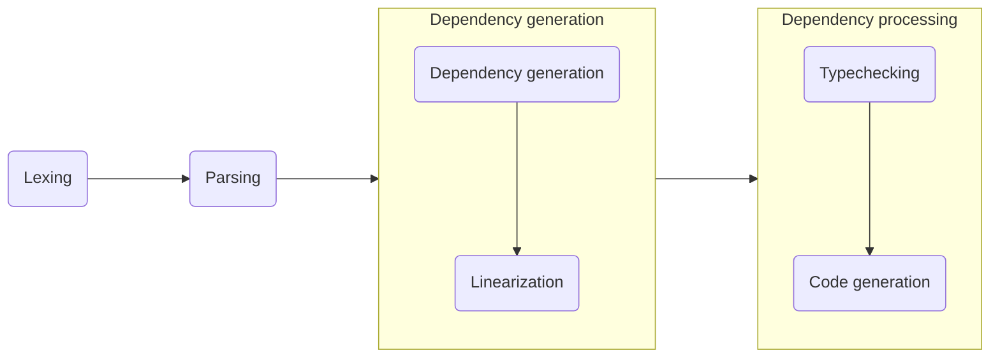

Internals
=========

```mermaid
flowchart LR
	subgraph depStage[Dependency generation]
		C(Dependency generation) ---> D(Linearization)
	end

	subgraph depProcStage[Dependency processing]
		E(Typechecking) ---> F(Code generation)
	end
	A(Lexing) ---> B(Parsing) ---> depStage ---> depProcStage
```

> The process of compilation in the reference TLang compiler

{{ git_page_authors }}