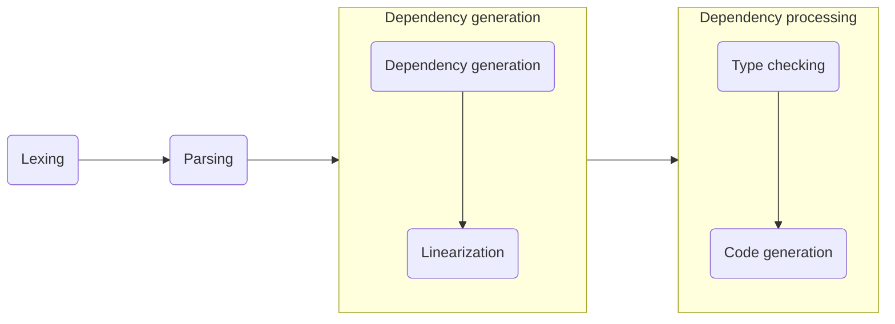

Internals
=========

> The process of compilation in the reference TLang compiler

 

This page contains a description of the implementation details of the reference
TLang compiler. Complete with a chapter per each stage and sub-stages of the so-called
_"compilation pipieline"_ (the process from of compiling a program from start to finish).

1. [Lexing](lexing/)
2. [Parsing](parsing/)
	1. [Tokens](parsing/tokens.md)
	2. [Structures](parsing/structures/)
3. [Dependency generation]()
	1. [Dependency generation]()
	2. [Linearization]()
4. [Dependency processing]()
	1. [Type checking]()
	2. [Code generation]()
5. **TODO**: FInal stage