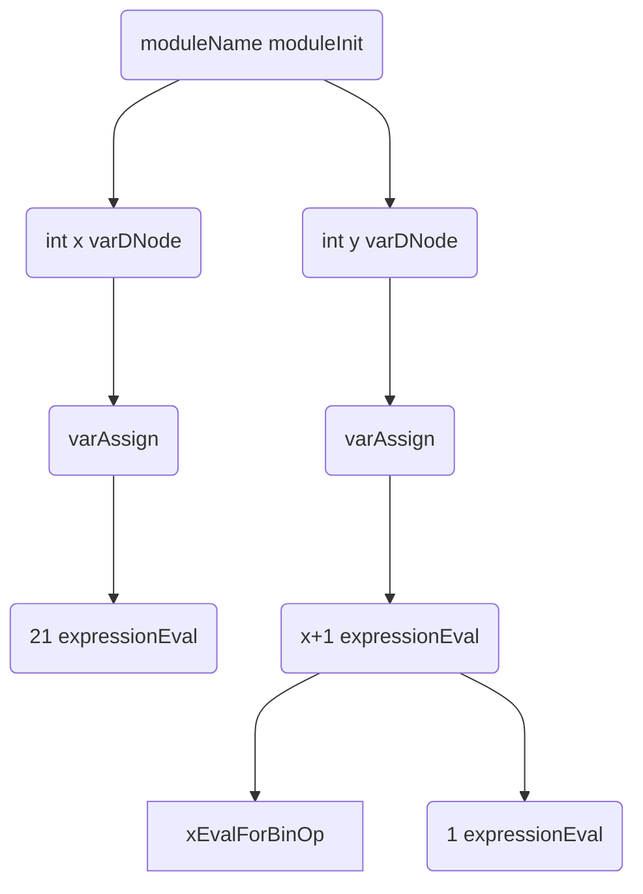

Parser tree generation
======================

TODO: Descrive visitor stuff here, recursive functions

Simply is an organization of the source code into a
code/in-memory form.

#### Example program

```c
module moduleName;
int x = 21;
int y = x+1;
```

#### Parser tree



As you can see no checks are being done, like on x’s existence
or declaration order. It is this tree that is ran through whilst
constructing the [_dependency tree_](/internals/deps/generation).