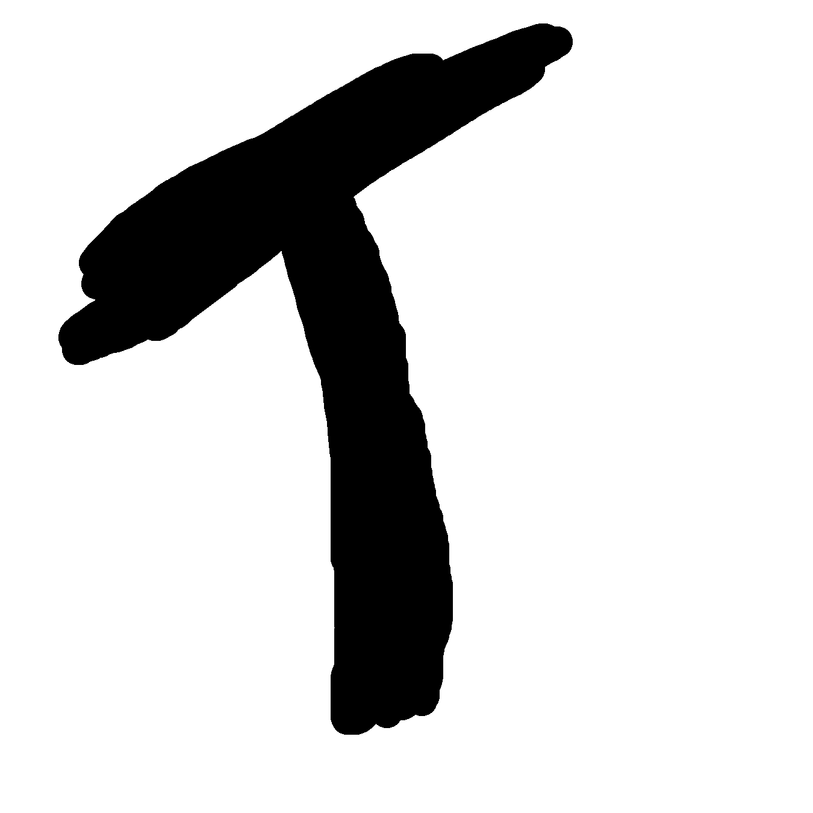

<!--
Old logo below (Deavmi's face)

-->

# Tristan Programming Language

The Tristan programming language is a systems programming language for the modern day that aims to achieve the following goals:

1. To be efficient in the generated code
2. Cross-platform support
3. A _"C"_ with classes that isn't bloated like C++
4. Weakly typed (unsafe) type system
5. To put all the control in the hands of the user
	* Memory layout
	* Argument passing
	* _And more..._

Welcome to the official homepage for the Tristan programming language project.

---

## Example programs

Take a look at some [example programs]() written in T!

## Get in touch

We're available on [BonoboNET](/projects/bonobonet) on the `#tlang`/`#t` channels.