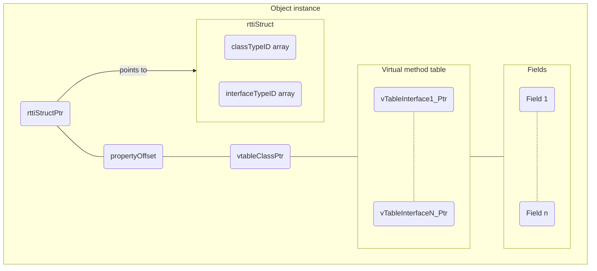

# Virtual Table implementation

This article aims to describe a possible virtual table implementation that we could use to for method dispatch that not only supports overriding but **also** interfaces.

As of so far the descriptions for the mechanism I came up with was only described through writing and with video explanations. Hopefully, in the future a text version (summrized) will be produced such that it can easily be digested. It will be under a nother version under the same title but with _"(text version)"_ appended to it.


<center>
    <video src="/secret/tlang_notes/20th%20April%202021/OOP/runtime_thunking/2021-04-20-200326.webm" controls></video>
    <p>Here I say <i>"Bruh"</i></p>
</center>


---

# Introduction

This section provides an introduction to the features we want to implement, the problems they cause and how to solve them.


<center>
    <video src="/secret/tlang_notes/20th%20April%202021/OOP/runtime_thunking/2021-04-20-200335.webm" controls></video>
    <p>Introduction</i></p>
</center>


This video describes what features we want in the language, what problems need to be solved to support them and why those problems exist.

The language is to support single-inheritance object-orientation but also with the ability to inherit from multiple interfaces (whilst the classes remain in a single hierachial order of inheritnce).

## Single inheritance of classes

We will only allow each class to inherit from one other class. Below is an example of what is allowed, we have a class `A` defined along with another class defined as `B` whereby `B` inherits from `A` (via the `:` operator).

```d
class A
{
    /* TODO: Code goes here */
}

class B : A
{
    /* TODO: Code goes here */
}
```

THe example below defines classes `A`, `B` and `C`, with `B` inheriting from `A` and `C`, in T this woudl **not** be allowed.

```d
class A
{
    /* TODO: Code goes here */
}

class C
{
    /* TODO: Code goes here */
}

class B : A, C
{
    /* TODO: Code goes here */
}
```

---

# Hypothetical secnario

In this situation I go about describing a situation and how my method would solve it. This part is several videos.


<center>
    <video src="/secret/tlang_notes/20th%20April%202021/OOP/runtime_thunking/2021-04-20-201005.webm" controls></video>
    <p>Describing a situation/scenario and how I would go about solving it (1/5)</i></p>
</center>



<center>
    <video src="/secret/tlang_notes/20th%20April%202021/OOP/runtime_thunking/2021-04-20-201622.webm" controls></video>
    <p>Describing a situation/scenario and how I would go about solving it (2/5)</i></p>
</center>



<center>
    <video src="/secret/tlang_notes/20th%20April%202021/OOP/runtime_thunking/2021-04-20-202902.webm" controls></video>
    <p>Describing a situation/scenario and how I would go about solving it (3/5)</i></p>
</center>



<center>
    <video src="/secret/tlang_notes/20th%20April%202021/OOP/runtime_thunking/2021-04-20-203529.webm" controls></video>
    <p>Describing a situation/scenario and how I would go about solving it (4/5)</i></p>
</center>



<center>
    <video src="/secret/tlang_notes/20th%20April%202021/OOP/runtime_thunking/2021-04-20-204452.webm" controls></video>
    <p>Describing a situation/scenario and how I would go about solving it (5/5)</i></p>
</center>


---

# Object Structure

This section aims to summarize the above into what the object structure would boil down to.

## Diagram (computerized)

Below is the memory layout of an object instance:



## Diagram (handwritten)

1. [PDF file 1](/secret/tlang_notes/20th%20April%202021/OOP/runtime_thunking/final_strategy.pdf)
2. [PDF file 2](/secret/tlang_notes/20th%20April%202021/OOP/runtime_thunking/first_stratergy_for_supporting_interfaces_parta.pdf)
3. [PDF file 3](/secret/tlang_notes/20th%20April%202021/OOP/runtime_thunking/first_stratergy_for_supporting_interfaces_partb.pdf)