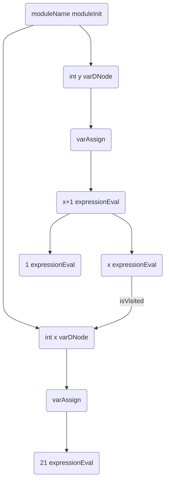

Dependency generation
=====================

The generation of the dependency tree is a rather involved process due to the fact that there are various different aspects of the language, both syntatical and semantic, that need to be accounted for when building the tree. At the core, however, the process is relatively simple.

All we have is a _dependency node_ which has a list of further dependencies. Dependencies have a flag for whether or not they have been visited and this prevents cycles (which are indeed possible). Another aspect is pooling - which is the mechanism used to map AST nodes to dependency nodes in a unique fashion.

## Terminology

### Dependency nodes

A dependency nodes is effectively a structure of the following layout:

```d linenums="1"
class DNode
{
	bool isVisited = false;
	DNode[] dependencies;
	Statement node;
}
```

1. The visitation status of the node is held in `isVisited` (line 3)
2. The nodes which this node is _dependent **upon**_ are held in an ordered list called `dependencies` (line 4)
3. The syntactical node that this dependency node stands in place for is held in the `node` field (line 5). This is optional but is normally used in most cases. The reason for this being optional is that sometimes a dependency node can be spawned in relation to another but does not necessarily encapuslate any AST node.


## Generation

TODO: Redo this section

Generates nodes indicating the ordered initialization of data structures.

The execution order is down furtherst left, then right.

### Introduction

#### Example program

```c
module moduleName;
int x = 21;
int y = x+1;
```

#### Dependency tree

**TODO:** Fix the VarAss-VarDec - they should be swapped around, check issue https://t.pxeger.com/mkdocs-material/setup/changing-the-fonts/ - once the issue is closed we can update this and probably the whole page



The actions taking place here are as follows:

1. varXEntity <- lookupVar(x)
2. poolVarDec(varXEntity) -> dNode
3. dnode.isVisited()
	* if `true` then ordering correct, else
	then implies y was declared before x and that is clearly wrong

Ordering correct then we are left with this tree above

### Difference between Parse trees and dependency trees

The difference here with this tree is that with the parser we don’t
know much about the existence of names like variable x and
therefore we need to add code that looks it up. `VariableEntity` (the
Node in the parse tree that represents a variable declaration)
Is not linked to any logic whether the variable exists or not.

So we have a set of mirroring `DNode`’s for each parse node kinda,

When we want see if `x` exists we lookup the `VarEntity` with
`lookup()`, this returns a parse node (`PNode`), which then is looked up
(ref checked in most cases of `Entity` -> `DNode` mappings) for its
Corresponding `DNode` (`varDecDNode`), we then check if it has
been visited with `isVisited()`.

But what if `y` came _before_ `x`, then the parse node lookup will
succeed (still), but the `DNode` map lookup won’t? No it will.

The lookup function for Dnode’s creates a new `DNode` if one
Doesn’t exist (this is called _pooling_). You pool by a Parse Entity.

Obviously if the entity was not mapped into the Dnode pool by its
`ParseEntity` then a newly initialized Dnode returned from the
`poolLookup()` will have the visited field defaulted to false. Hence
Implementing the correct variable declaration ordering
mechanism.


Read about [parser trees](/internals/parsing/generation.md).

!!! warning
	There are other pooling mechanisms for different needs, some
	include more then refMatching the ParseEntity’s


---

### Continued.

One thing must be noted that would have not been done in the
previous code example. Once we are done parsing and have
Our parse tree for our code, below:

```c
module moduleName;
int x = 21;
int y = x+1;

Class A
{
	Static int poes;
	int fuck;
}
```

Before we pass the parse tree to the typechecker (where
dependency stuff can be generated off of it). We first re-order
naming, class’s then functions (I think) then variables.

This isn’t because of some sort of hard-to-figure-out
algorithm, not it’s just that for naming I want classes to have
precedence, such that when the typechecking does collision
detection that it will be a variable named A that is in the wrong

Rather than the class (an example is below):

```c
module moduleName;
int A;
Class A
{
	Static int poes;
	int fuck;
}
```

---

Therefore that piece of code would complain that int a, is invalid
The same would happen for the below:

```c
module moduleName;
Class A
{
	Static int poes;
	int fuck;
}

int A;
```

This is because it would have no re-ordering here as it is already
In the correct order.

**Now** that isn’t the important part of this section, I mean it is
But that isn’t what I wanted to explain.... So I digress....

---

So what is special about this code?

```c
module moduleName;
Class A
{
	Static int poes;
	int fuck;
}

A x;
```

Well we don’t run anything that initialises the class just because
It appears as the first item in the parse tree whilst we are
generating our dependency tree, no – what actually happens is
The first type reference to the class A will cause a _static
initialization_ of the class, meaning all it’s _**members**_ marked as
`static` will be initialized. Infact below you can see what will occur:

So we first make a varInit, but then hat has dependencies to first
be met before we get to, say now, a possible assignment (if it
existed above), `class A` will then be statically init-ting which
implies it is dependent on the `varDec` initialization of `static int
poes`.

Only after then will the `varDec` continue init-ting it’s assignment. If
any. So as you can see some language aspects have rules that
don’t follow the path of the parser – which if we drew would have
the class appear before the variable declaration which is
syntactically correct but semantically in terms of initialization and
code generation – is not.

!!! note
	**What to take away**: Parse entities do not necessarily initialization entities.

---

So what is special about this code? (continued)

```c
module moduleName;
Class A
{
	Static int poes;
	int fuck;
}

A x;
A y;
```

Here we would generate a `varDec` for `x`, but it has depends on
the static initialization of `class A`, which in turn depends on the
`poes` **static init**. Implying first we initialize `poes`, then the class
(statically) as all its dependencies are met so itself must now
finish, then we would run `varDec` init for variable `x`.

The class’s _static initialization_ node is marked as visited too,
such that when we do something similar for variable `y` the only
thing that is there is the `varDec` and is immediately run (no
dependencies)

At the end of the dependency tree generation and type checking,
(or during it rather) we will be able to simply emit these entities
As they will create the correct code:


	staticInitA()
	declarex()
	delcareY()


Is what the above boils down to.

---

So what is special about this code? (continued)

```c
module moduleName;
Class A
{
	Static int poes;
	int fuck;
}

A x;
A y;
```

An important thing to remember is how emitting will be done.
You visit the first dependency in the dependency list of each
`DNode` (ordered like that). And keep doing so recursively till no
dependencies left.

1. If there are no dependencies left then you run emit. So you
can see how after completing your dependencies (which
probably emitted something) that _**only then**_ you can emit your
code (as it can safely execute knowing the resources it relies on
exist (properly exist).