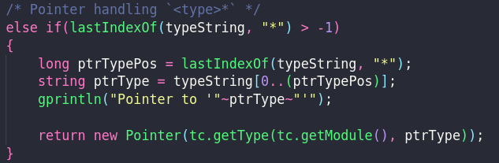
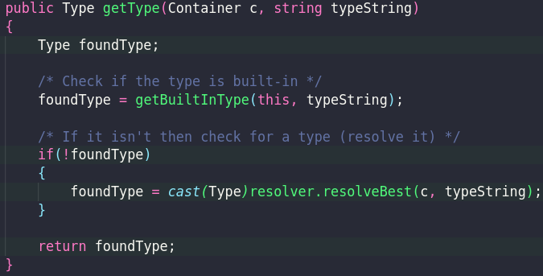

# July 2022 Updates

Just a quick little update on what has been being worked on for TLang this month. I had taken quite a big break from the project
as I had a lot of university work I needed to get through and then also decided to work on some other projects before returning
to this one.

## Additions

### String support

String support has always been present at the lexical and parsing level however it was not in the type checker level. I have since
added support to the typechecker to recognize strings, set the correct type (`char*` which is equivalent to `byte*`) and then also
generate a `StringInstruction` (which is a _kind-of_ `Value` instruction). This new instruction uses a hashtable to pool the string
constants of the same value to a single ID which will be useful later for code emitting and string references to support **string interning**.

### Type resolver

The built-in type resolver has also been having some work added to it. Normally we call the `getType()` method on the `TypeChecker`
object to resolve a `TypeEntity` (a _kind-of_ `Entity` used for types), if something is not a built-in type then it will try
resolve such an entity, however if it **is** then we call we call the `getBuiltInType()` method - this is probably not the correct
behaviour - as we should probably test this with something like `UserDefinedType*` (as you will see we have pointer support for
basic types now). I have now added support (at the basic levels) for resolving something in the case of `<type>*`, `<type>**`
and so on, by adding what I call a _chop-and-recurse_ strategy to the pointer type resolution in that method, this also means
that the `getBuiltInTypes()` now takes in the `TypeChecker` object so it can resolve types. Technically it should also then be
taking in the `Container` that `getType()` takes in, as for now it does a global type resolution which might not be the case -
but it works for now.

The change in the future would be very easy, we would not use a `tc.getType(tc.getModulle())` but rather `tc.getType(container)`. It's an easy change but one
I will add in later.

I will need to take a look at the main `getType()` (as shown below) and maybe change the resolution order, or, in the else statement
of the `getBuiltInType()` mutually recur to `getType()` after a chop-and-recurse of some sorts. Actually, on second thought, this should
resolve user-defined types. Yeah, this is probably fine but [here](http://deavmi.assigned.network/git/tlang/tlang/issues/1) is a todo/note
list.

## Work in progress

Things currently in the testing phase.

### Floating point constants

The lexer or _tokenizer_ (the module which turns input source code into discrete items or _tokens_) would normally parse something
like `1.3` as a path to mean the field `3` in the `1` object, but obviously if both operands to the `.` operator are numbers then this
should rather be seen as a floating point constant - this, however, was not the case. Therefore I have added support for this and it
is now in the testing phase currently.